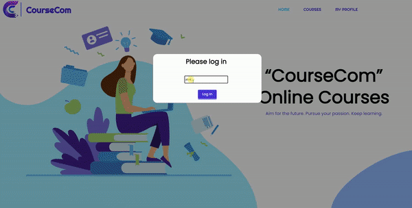
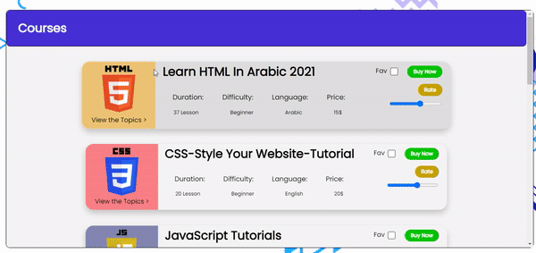
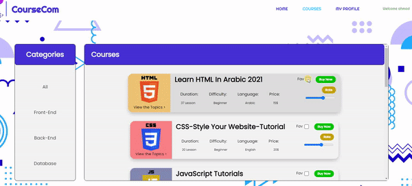
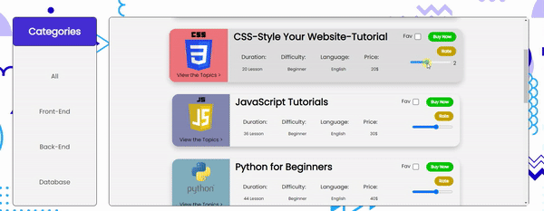
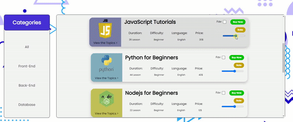
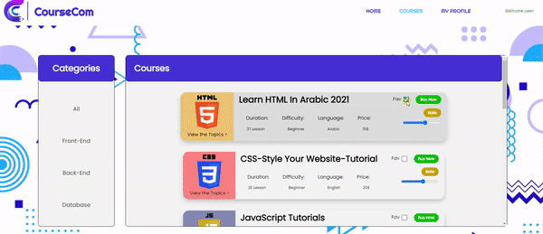
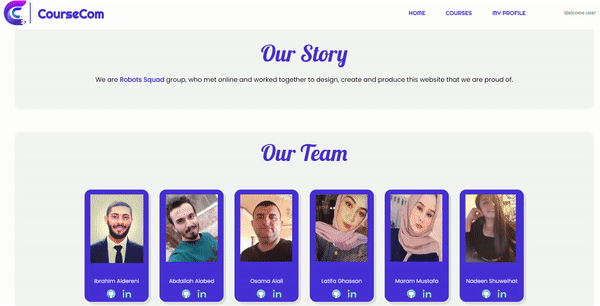

# Intro:

This project repository for a website called **CourseCom** which offers online courses in web development field, created by a team of developers called **Robots Sqaud**.

# Contributers:

A team called **Robots Sqaud** worked together to make this website come true:

1. Ibrahim Aldereni
2. Osama Alali
3. Abdulla Abed
4. Latifa Ghassan
5. Maram Mustafa
6. Nadeen Shuweihat

# Problem Domain:

At these days it's hard to find a good course with good instructor in web development on a wide range of videos and websites scattered on the internet, so we created a website called **CourseCom** that narrows and simplify the search for the user by providing all courses and best instructors in one place.
 
CourseCom offers online courses, covers all web devevelopiong fields, provide good price, each course has a dedicated videos which will provide you with detailed and essential informations. Our website connect students to the best instructors, authored by colleges, universities and other institutions, that include opportunities for instructor-to-student interactivity, and that's back to our global community in many ways By facilitating the method of learning and providing many student needs with the lowest price and effort.

# How to use Our website:

+ In homepage the user must login with his name then he can see a brief informations about what the site provide and a links to all pages.

  
 
+ In courses page the user can choose from multiple categories, each category consists of different types courses, this page allow the user to:
  + View each course topics.

    

  + Set course to favorite and Buy a course (after the user buy the course, the link of the course appears):

    

  + Rate the course (the user use the slider to set the rate number and then press on rate button to submit the rate):

    

  + At the bottom of the page the user finds a chart of total ratings.

      

+ In profile page, the user will find his/her purchases and favourite list, and he/she can also log out from the website.

  

+ In abouts us the user will see the team story and images who made this website, and at the bottom, he/she can give a feedback about our website.

  

# Resourses:

[How To Create a Modal Box](https://www.w3schools.com/howto/howto_css_modals.asp)

[Card Flip](https://learn.shayhowe.com/advanced-html-css/transitions-animations/)